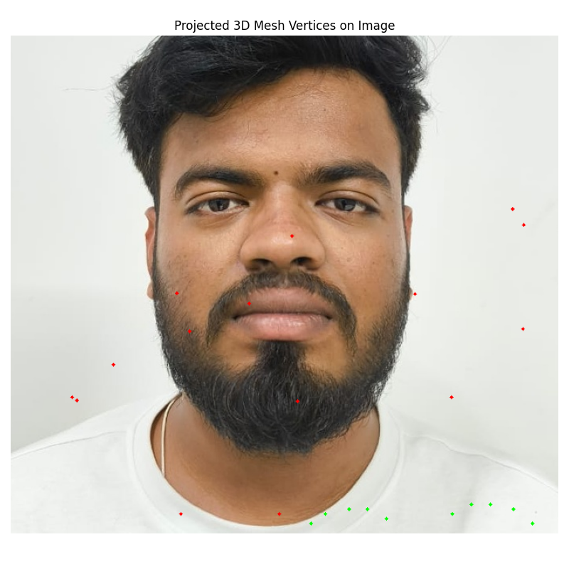

# Multi-View 3D Face Reconstruction

This project provides a learning-based, multi-view 3D face reconstruction pipeline capable of generating textured 3D face meshes (.obj with UV maps) using 3-4 RGB images of a subject taken from fixed camera positions.

## Features

- Face detection and landmark extraction
- Camera pose estimation from facial landmarks
- 3D face shape reconstruction using FLAME morphable model
- Textured 3D mesh output with UV mapping
- Support for multi-view input for improved accuracy

## Installation

### Requirements

- Python 3.7-3.10 (recommended)
- PyTorch
- OpenCV
- FLAME model (requires download with license)

### Setup

1. Clone this repository
   ```bash
   git clone <repository-url>
   cd 3d_face_recon
   ```

2. Create and activate a virtual environment
   ```bash
   python -m venv venv
   source venv/bin/activate  # On Windows: venv\Scripts\activate
   ```

3. Install dependencies
   ```bash
   pip install -r requirements.txt
   ```

4. Download the FLAME model:
   - Go to https://flame.is.tue.mpg.de/
   - Register and accept the license agreement
   - Download "FLAME 2020 (FLAME 2020 with 300 shape and 100 expression parameters)"
   - Extract and place `FLAME2020.pkl` in the `models/flame/` directory

## Usage

### Basic Usage

1. Place your input images in `data/raw/` directory 
   - Use 3-4 images of the same person from different angles
   - Ensure the face is clearly visible in each image

2. Run the full pipeline:
   ```bash
   python main.py
   ```

3. Find the output 3D textured mesh files in `data/obj/` directory

### Advanced Usage

The pipeline can be customized with various options:

```bash
python main.py --input-dir custom/input/path --device cpu --iterations 200
```

Run `python main.py --help` for all available options.

### Individual Pipeline Steps

You can also run individual components of the pipeline:

1. **Preprocessing**: Face detection and alignment
   ```bash
   python scripts/preprocess.py --input data/raw --output data/processed
   ```

2. **Pose Estimation**: Estimate relative camera poses
   ```bash
   python scripts/pose_estimation.py --input data/processed --output data/poses
   ```

3. **3DMM Fitting**: Fit FLAME model to detected facial landmarks
   ```bash
   python scripts/fit_3dmm.py --input data/processed --output data/3dmm_fits
   ```

4. **OBJ Export**: Generate textured 3D mesh
   ```bash
   python scripts/export_obj.py --input data/3dmm_fits --images data/processed --output data/obj
   ```

## Pipeline Structure

- **Preprocessing**: Detect and align faces, extract landmarks
- **Pose Estimation**: Calculate camera positions relative to the face
- **3DMM Fitting**: Fit FLAME model parameters to the detected landmarks
- **Texture Mapping**: Project image colors onto the 3D mesh
- **OBJ Export**: Generate the final textured 3D model

## Visualization Examples

Below are some visualization results from the pipeline:

**Mesh Projection Overlay**



**MediaPipe Landmarks Overlay**


**UV Overlay**


**UV Scatter**


## License

This project is built independently. However, note that the FLAME model has its own license that must be followed when using this pipeline. 